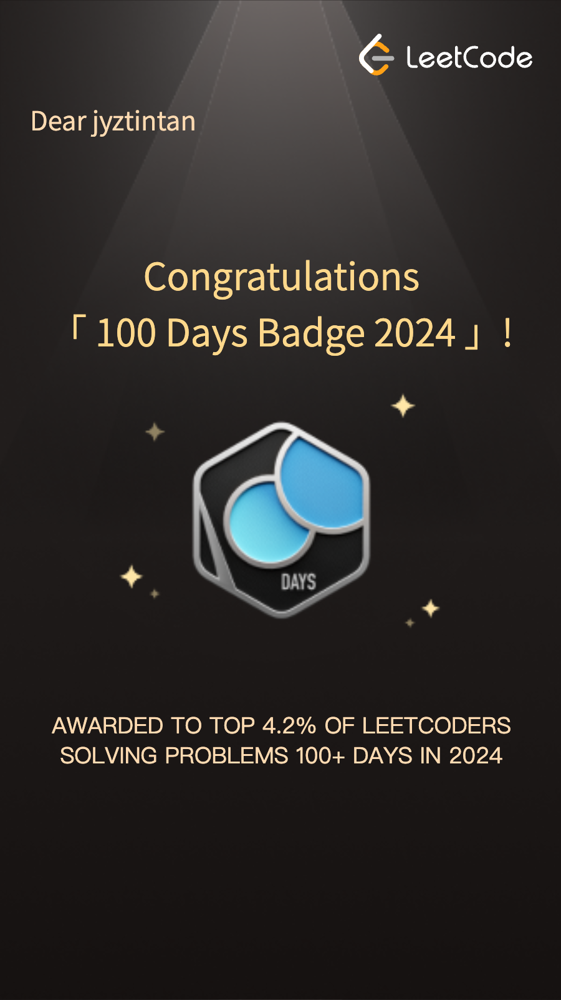

# Leetcode

  
  
  

| ID   | Problem Name                                                                | Solution                                                                                                                                                                                                                                                                                                                              |
|------|-----------------------------------------------------------------------------|---------------------------------------------------------------------------------------------------------------------------------------------------------------------------------------------------------------------------------------------------------------------------------------------------------------------------------------|
| 1    | Two Sum                                                                     |                              |
| 2    | Add Two Numbers                                                             |                      |
| 3    | Longest Substring without Repeating Characters                              |                                                                                                                                                        |
| 4    | Median of Two Sorted Arrays                                                 |                                                                                                                                                                   |
| 5    | Longest Palindromic Substring                                               |                                                                                                                                                              |
| 6    | Zigzag Conversion                                                           |                                                                                                                                                                          |
| 7    | Reverse Integer                                                             |                                                                                                                                                                                |
| 8    | String to Integer (atoi)                                                    |                                                                                                                                                                            |
| 11   | Container With Most Water                                                   |                                                                                                                                                                       |
| 13   | Roman to Integer                                                            |                                                                                                                                                                           |
| 15   | 3Sum                                                                        |                                                                                                                                                                                  |
| 17   | Letter Combinations of a Phone Number                                       |                                                                                                                                                           |
| 19   | Remove Nth Node from End of List                                            |                                                                                                                                                                   |
| 20   | Valid Parentheses                                                           |                                                                                                                                                                          |
| 21   | Merge Two Sorted Lists                                                      |                                                                                                                                                                     |
| 22   | Generate Parentheses                                                        |                                                                                                                                                                       |
| 23   | Merge k Sorted Lists                                                        |                                                                                                                                                                       |
| 24   | Swap Nodes in Pairs                                                         |                                                                                                                                                                        |
| 25   | Reverse Nodes in k-Group                                                    |                                                                                                                                                                     |
| 33   | Search in Rotated Sorted Array                                              |                                                                                                                                                                |
| 36   | Valid Sudoku                                                                |                                                                                                                                                                               |
| 39   | Combination Sum                                                             |                                                                                                                                                                            |
| 40   | Combination Sum II                                                          |                                                                                                                                                                         |
| 42   | Trapping Rain Water                                                         |                                                                                                                                                                        |
| 45   | Jump Game II                                                                |                                                                                                                                                                               |
| 46   | Permutations                                                                |                                                                                                                                                                               |
| 49   | Group Anagrams                                                              |                                                                                                                                                                             |
| 51   | N-Queens                                                                    |                                                                                                                                                                             |
| 53   | Maximum Subarray                                                            |                                                                                                                                                                               |
| 54   | Spiral Matrix                                                               |                                                                                                                                                                              |
| 55   | Jump Game                                                                   |                                                                                                                                                                                  |
| 56   | Merge Intervals                                                             |                                                                                                                                                                            |
| 57   | Insert Interval                                                             |                                                                                                                                                                            |
| 59   | Spiral Matrix II                                                            |                                                                                                                                                                           |
| 61   | Rotate List                                                                 |                                                                                                                                                                                |
| 62   | Unique Paths                                                                |                                                                                                                                                                               |
| 70   | Climbing Stairs                                                             |                                                                                                                                                                            |
| 72   | Edit Distance                                                               |                                                                                                                                                                              |
| 74   | Search a 2D Matrix                                                          |                                                                                                                                                                           |
| 75   | Sort Colours                                                                |                                                                                                                                                                               |
| 76   | Minimum Window Substring                                                    |                                                                                                                                                                       |
| 78   | Subsets                                                                     |                                                                                                                                                                                    |
| 79   | Word Search                                                                 |                                                                                                                                                                                |
| 84   | Largest Rectangle in Histogram                                              |                                                                                                                                                                |
| 85   | Maximal Rectangle                                                           |                                                                                                                                                                          |
| 90   | Subsets II                                                                  |                                                                                                                                                                                 |
| 91   | Decode Ways                                                                 |                                                                                                                                                                                |
| 94   | Binary Tree Inorder Traversal                                               |                                                                                                                                                              |
| 97   | Interleaving String                                                         |                                                                                                                                                                        |
| 98   | Validate Binary Search Tree                                                 |                                                                                                                                                                               |
| 100  | Same Tree                                                                   |                                                                                                                                                                                   |
| 102  | Binary Tree Level Order Traversal                                           |                                                                                                                                                          |
| 104  | Maximum Depth of Binary Tree                                                |                                                                                                                                                                              |
| 105  | Construct Binary Tree from Preorder and Inorder Traversal                   |                                                                                                                                                     |
| 106  | Construct Binary Tree from Postorder and Inorder Traversal                  |                                                                                                                                                    |
| 109  | Convert Sorted List to Binary Search Tree                                   |                                                                                                                                                                    |
| 110  | Balanced Binary Tree                                                        |                                                                                                                                                                               |
| 112  | Path Sum                                                                    |                                                                                                                                                                                   |
| 113  | Path Sum II                                                                 |                                                                                                                                                                                |
| 114  | Flatten Binary Tree to Linked List                                          |                                                                                                                                                            |
| 115  | Distinct Subsequences                                                       |                                                                                                                                                                      |
| 121  | Best Time to Buy and Sell Stock                                             |                                                                                                                                                            |
| 124  | Binary Tree Maximum Path Sum                                                |                                                                                                                                                                   |
| 125  | Valid Palindrome                                                            |                                                                                                                                                                           |
| 127  | Word Ladder                                                                 |                                                                                                                                                                                |
| 128  | Longest Consecutive Sequence                                                |                                                                                                                                                                    |
| 130  | Surrounded Regions                                                          |                                                                                                                                                                         |
| 131  | Palindrome Partitioning                                                     |                                                                                                                                                                    |
| 133  | Clone Graph                                                                 |                                                                                                                                                                                |
| 134  | Gas Station                                                                 |                                                                                                                                                                                |
| 138  | Copy List with Random Pointer                                               |                                                                                                                                                              |
| 139  | Word Break                                                                  |                                                                                                                                                                                 |
| 141  | Linked List Cycle                                                           |                                                                                                                                                                          |
| 143  | Reorder List                                                                |                                                                                                                                                                               |
| 144  | Binary Tree Preorder Traversal                                              |                                                                                                                                                             |
| 145  | Binary Tree Postorder Traversal                                             |                                                                                                                                                            |
| 146  | LRU Cache                                                                   |                                                                                                                                                                                  |
| 150  | Evaluate Reverse Polish Notation                                            |                                                                                                                                                                               |
| 152  | Maximum Product Subarray                                                    |                                                                                                                                                                       |
| 153  | Find Minimum in Rotated Sorted Array                                        |                                                                                                                                                              |
| 155  | Min Stack                                                                   |                                                                                                                                                                                  |
| 167  | Two Sum II (Input Array is Sorted)                                          |                                                                                                                                                                             |
| 175  | Combine Two Tables                                                          |                                                                                                                                                                |
| 198  | House Robber                                                                |                                                                                                                                                                               |
| 199  | Binary Tree Right Side View                                                 |                                                                                                                                                                |
| 200  | Number of Islands                                                           |                                                                                                                                                                             |
| 206  | Reverse Linked List                                                         |                                                                                                                                                                        |
| 207  | Course Schedule                                                             |                                                                                                                                                                            |
| 208  | Implement Trie (Prefix Tree)                                                |                                                                                                                                                                             |
| 210  | Course Schedule II                                                          |                                                                                                                                                                         |
| 211  | Design Add and Search Words Data Structure                                  |                                                                                                                                                                 |
| 212  | Word Search II                                                              |                                                                                                                                                                             |
| 213  | House Robber II                                                             |                                                                                                                                                                            |
| 215  | Kth Largest Element in an Array                                             |                                                                                                                                                                  |
| 217  | Contains Duplicate                                                          |        |
| 226  | Invert Binary Tree                                                          |                                                                                                                                                                         |
| 230  | Kth Smallest Element in a BST                                               |                                                                                                                                                                   |
| 235  | Lowest Common Ancestor of a Binary Search Tree                              |                                                                                                                                                                 |
| 235  | Lowest Common Ancestor of a Binary Tree                                     |                                                                                                                                                         |
| 238  | Product of Array Except Self                                                |                                                                                                                                                                  |
| 239  | Sliding Window Maximum                                                      |                                                                                                                                                                         |
| 242  | Valid Anagram                                                               |                  |
| 252  | Meeting Rooms                                                               |                                                                                                                                                                              |
| 253  | Meeting Rooms II                                                            |                                                                                                                                                                           |
| 257  | Binary Tree Paths                                                           |                                                                                                                                                                          |
| 261  | Graph Valid Tree                                                            |                                                                                                                                                                           |
| 264  | Ugly Number II                                                              |                                                                                                                                                                             |
| 271  | Encode and Decode Strings                                                   |   |
| 273  | Integer to English Words                                                    |                                                                                                                                                                   |
| 283  | Move Zeroes                                                                 |                                                                                                                                                                                |
| 286  | Walls and Gates                                                             |                                                                                                                                                                            |
| 287  | Find the Duplicate Number                                                   |                                                                                                                                                                      |
| 295  | Find Median from Data Stream                                                |                                                                                                                                                                    |
| 297  | Serialize and Deserialize Binary Tree                                       |                                                                                                                                                          |
| 300  | Longest Increasing Subsequence                                              |                                                                                                                                                             |
| 309  | Best Time to Buy and Sell Stock with Cooldown                               |                                                                                                                                                          |
| 312  | Burst Balloons                                                              |                                                                                                                                                                             |
| 322  | Coin Change                                                                 |                                                                                                                                                                                |
| 323  | Number of Connected Components In An Undirected Graph                       |                                                                                                                                                  |
| 329  | Longest Increasing Path in a Matrix                                         |                                                                                                                                                             |
| 330  | Patching Array                                                              |                                                                                                                                                                             |
| 347  | Top K Frequent Elements                                                     |                 |
| 349  | Intersection of Two Arrays                                                  |                                                                                                                                                                    |
| 350  | Intersection of Two Arrays II                                               |                                                                                                                                                                 |
| 355  | Design Twitter                                                              |                                                                                                                                                                             |
| 394  | Decode String                                                               |                                                                                                                                                                              |
| 416  | Partition Equal Subset Sum                                                  |                                                                                                                                                                 |
| 417  | Pacific Atlantic Water Flow                                                 |                                                                                                                                                                |
| 424  | Longest Repeating Character Replacement                                     |                                                                                                                                                         |
| 429  | N-ary Tree Level Order Traversal                                            |                                                                                                                                                           |
| 435  | Non-Overlapping Intervals                                                   |                                                                                                                                                                  |
| 438  | Find All Anagrams in a String                                               |                                                                                                                                                                    |
| 476  | Number Complement                                                           |                                                                                                                                                                          |
| 494  | Target Sum                                                                  |                                                                                                                                                                                 |
| 502  | IPO                                                                         |                                                                                                                                                                    |
| 518  | Coin Change II                                                              |                                                                                                                                                                             |
| 535  | Encode & Decode TinyURL                                                     |                                                                                                                                                                    |
| 538  | Convert BST to Greater Tree                                                 |                                                                                                                                                                                 |
| 543  | Diameter of Binary Tree                                                     |                                                                                                                                                                               |
| 547  | Number of Provinces                                                         |                                                                                                                                                                           |
| 564  | Find the Closest Palindrome                                                 |                                                                                                                                                                    |
| 567  | Permutation in String                                                       |                                                                                                                                                                      |
| 572  | Subtree of Another Tree                                                     |                                                                                                                                                                    |
| 589  | N-ary Tree Preorder Traversal                                               |                                                                                                                                                              |
| 590  | N-ary Tree Postorder Traversal                                              |                                                                                                                                                             |
| 592  | Fraction Addition and Subtraction                                           |                                                                                                                                                              |
| 621  | Task Scheduler                                                              |                                                                                                                                                                             |
| 624  | Maximum Distance in Arrays                                                  |                                                                                                                                                                         |
| 633  | Sum of Square Numbers                                                       |                                                                                                                                                                      |
| 647  | Palindromic Substrings                                                      |                                                                                                                                                                     |
| 650  | 2 Keys Keyboard                                                             |                                                                                                                                                                          |
| 653  | Two Sum IV - Input is a BST                                                 |                                                                                                                                                                       |
| 664  | Strange Printer                                                             |                                                                                                                                                                            |
| 678  | Valid Parenthesis String                                                    |                                                                                                                                                                   |
| 684  | Redundant Connection                                                        |                                                                                                                                                                       |
| 685  | Redundant Connection II                                                     |                                                                                                                                                                    |
| 695  | Max Area of Island                                                          |                                                                                                                                                                         |
| 703  | Kth Largest Element in a Stream                                             |                                                                                                                                                                 |
| 704  | Binary Search                                                               |                                                                                                                                                                              |
| 719  | Find K-th Smallest Pair Distance                                            |                                                                                                                                                                |
| 725  | Split Linked List in Parts                                                  |                                                                                                                                                                    |
| 726  | Number of Atoms                                                             |                                                                                                                                                                               |
| 739  | Daily Temperature                                                           |                                                                                                                                                                          |
| 746  | Min Cost Climbing Stairs                                                    |                                                                                                                                                                   |
| 763  | Partition Labels                                                            |                                                                                                                                                                           |
| 826  | Most Profit Assigning Work                                                  |                                                                                                                                                                 |
| 840  | Magic Squares In Grid                                                       |                                                                                                                                                                      |
| 846  | Hand of Straights                                                           |                                                                                                                                                                          |
| 853  | Car Fleet                                                                   |                                                                                                                                                                                  |
| 860  | Lemonade Change                                                             |                                                                                                                                                                            |
| 874  | Walking Robot Simulation                                                    |                                                                                                                                                                   |
| 875  | Koko Eating Bananas                                                         |                                                                                                                                                                        |
| 885  | Spiral Matrix III                                                           |                                                                                                                                                                          |
| 889  | Construct Binary Tree from Preorder and Postorder Traversal                 |                                                                                                                                                   |
| 912  | Sort an Array                                                               |                                                                                                                                                                              |
| 945  | Minimum Increment to Make Array Unique                                      |                                                                                                                                                                 |
| 947  | Most Stones Removed with Same Row or Column                                 |                                                                                                                                                        |
| 959  | Regions Cut by Slashes                                                      |                                                                                                                                                                     |
| 973  | K Closest Points to Origin                                                  |                                                                                                                                                                           |
| 974  | Subarray Sums Divisible by K                                                |                                                                                                                                                                            |
| 981  | Time Based Key-Value Store                                                  |                                                                                                                                                                 |
| 994  | Rotting Oranges                                                             |                                                                                                                                                                            |
| 995  | Minimum Number of K Consecutive Bit Flips                                   |                                                                                                                                                                |
| 1009 | Complement of Base 10 Integer                                               |                                                                                                                                                                         |
| 1038 | Binary Search Tree to Greater Sum Tree                                      |                                                                                                                                                                                 |
| 1046 | Last Stone Weight                                                           |                                                                                                                                                                          |
| 1052 | Grumpy Bookstore Owner                                                      |                                                                                                                                                                     |
| 1105 | Filling Bookcase Shelves                                                    |                                                                                                                                                                   |
| 1110 | Delete Nodes And Return Forest                                              |                                                                                                                                                                 |
| 1122 | Relative Sort Array                                                         |                                                                                                                                                                        |
| 1140 | Stone Game II                                                               |                                                                                                                                                                              |
| 1143 | Longest Common Subsequence                                                  |                                                                                                                                                                 |
| 1190 | Reverse Substrings Between Each Pair of Parentheses                         |                                                                                                                                                        |
| 1248 | Count Number of Nice Subarrays                                              |                                                                                                                                                                   |
| 1310 | XOR Queries of a Subarray                                                   |                                                                                                                                                                         |
| 1334 | Find the City With the Smallest Number of Neighbors at a Threshold Distance |                                                                                                                                                          |
| 1367 | Linked List in Binary Tree                                                  |                                                                                                                                                                    |
| 1380 | Lucky Numbers in a Matrix                                                   |                                                                                                                                                                    |
| 1382 | Balance a Binary Search Tree                                                |                                                                                                                                                                                |
| 1395 | Count Number of Teams                                                       |                                                                                                                                                                            |
| 1438 | Longest Continuous Subarray with Limit                                      |                                                                                                                                                                |
| 1448 | Count Good Nodes in Binary Tree                                             |                                                                                                                                                               |
| 1460 | Make Two Arrays Equal by Reversing Subarrays                                |                                                                                                                                                                      |
| 1480 | Running Sum of 1d Array                                                     |                                                                                                                                                                        |
| 1482 | Minimum Number of Days to Make m Bouquets                                   |                                                                                                                                                                        |
| 1508 | Range Sum of Sorted Subarray Sums                                           |                                                                                                                                                             |
| 1509 | Minimum Difference Between Largest and Smallest Value in Three Moves        |                                                                                                                                                                       |
| 1514 | Path with Maximum Probability                                               |                                                                                                                                                                         |
| 1518 | Water Bottles                                                               |                                                                                                                                                                              |
| 1530 | Number of Good Leaf Nodes Pairs                                             |                                                                                                                                                                   |
| 1550 | Three Consecutive Odds                                                      |                                                                                                                                                                     |
| 1552 | Magnetic Force Between Two Balls                                            |                                                                                                                                                               |
| 1568 | Minimum Number of Days to Disconnect Island                                 |                                                                                                                                                            |
| 1579 | Remove Max Number of Edges to Keep Graph Fully Traversable                  |                                                                                                                                                         |
| 1598 | Crawler Log Folder                                                          |                                                                                                                                                                         |
| 1605 | Find Valid Matrix Given Row and Column Sums                                 |                                                                                                                                                          |
| 1636 | Sort Array by Increasing Frequency                                          |                                                                                                                                                            |
| 1653 | Minimum Deletions to Make String Balanced                                   |                                                                                                                                                         |
| 1684 | Count the Number of Consistent Strings                                      |      |
| 1701 | Average Waiting Time                                                        |     |
| 1717 | Maximum Score From Removing Substrings                                      |                                                                                                                                                                 |
| 1791 | Find Center of Star Graph                                                   |  |
| 1823 | Find the Winner of the Circular Game                                        |                                                                                                                                                                  |
| 1851 | Minimum Interval to Include Each Query                                      |                                                                                                                                                            |
| 1894 | Find the Student that Will Replace the Chalk                                |                                                                                                                                                                 |
| 1899 | Merge Triplets to Form Target Triplet                                       |                                                                                                                                                         |
| 1905 | Count Sub Islands                                                           |                                                                                                                                                                          |
| 1937 | Maximum Number of Points with Cost                                          |                                                                                                                                                                       |
| 1945 | Sum of Digits of String After Convert                                       |                                                                                                                                                            |
| 2022 | Convert 1D Array Into 2D Array                                              |                                                                                                                                                                         |
| 2028 | Find Missing Observations                                                   |                                                                                                                                                                  |
| 2037 | Minimum Number of Moves to Seat Everyone                                    |                                                                                                                                                                          |
| 2045 | Second Minimum Time to Reach Destination                                    |                                                                                                                                                                 |
| 2053 | Kth Distinct String in an Array                                             |                                                                                                                                                               |
| 2058 | Find the Minimum and Maximum Number of Nodes Between Critical Points        |                                                                                                                                                               |
| 2096 | Step-By-Step Directions From a Binary Tree Node to Another                  |                                                                                                                                                        |
| 2134 | Minimum Swaps to Group All 1's Together II                                  |                                                                                                                                                           |
| 2181 | Merge Nodes in Between Zeros                                                |                                                                                                                                                                  |
| 2191 | Sort the Jumbled Numbers                                                    |                                                                                                                                                                       |
| 2192 | All Ancestors of a Node in a Directed Acyclic Graph                         |                                                                                                                                                                  |
| 2196 | Create Binary Tree From Descriptions                                        |                                                                                                                                                            |
| 2220 | Minimum Bit Flips to Convert Number                                         |                                                                                                                                                                  |
| 2248 | Intersection of Multiple Arrays                                             |                                                                                                                                                               |
| 2285 | Maximum Total Importance of Roads                                           |                                                                                                                                                                 |
| 2326 | Spiral Matrix IV                                                            |                                                                                                                                                                           |
| 2392 | Build a Matrix With Conditions                                              |                                                                                                                                                               |
| 2418 | Sort the People                                                             |                                                                                                                                                                            |
| 2419 | Longest Subarray With Maximum Bitwise AND                                   |                                                                                                                                                             |
| 2582 | Pass the Pillow                                                             |                                                                                                                                                                            |
| 2678 | Number of Senior Citizens                                                   |                                                                                                                                                                        |
| 2699 | Modify Graph Edge Weights                                                   |                                                                                                                                                                  |
| 2751 | Robot Collisions                                                            |                                                                                                                                                                           |
| 2807 | Insert Greatest Common Divisors in Linked List                              |                                                                                                                                                                     |
| 2976 | Minimum Cost to Convert String I                                            |                                                                                                                                                                    |
| 3016 | Minimum Number of Pushes to Type Word II                                    |                                                                                                                                                                |
| 3153 | Sum of Digit Differences of All Pairs                                       |                                                                                                                                                                   |
| 3217 | Delete Nodes From Linked List Present in Array                              |                                                                                                                                                                   |
